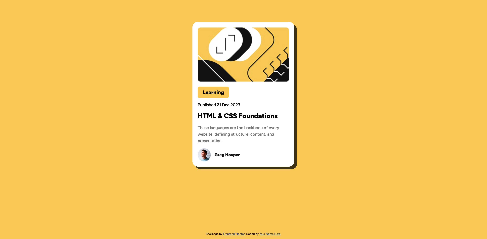
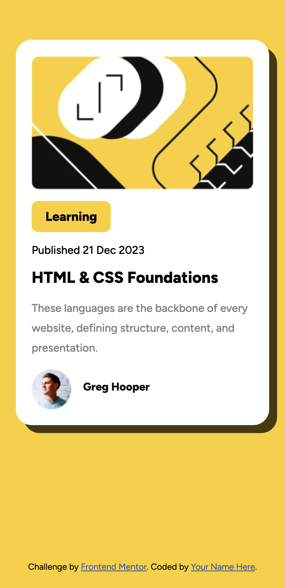

# Frontend Mentor - Blog preview card solution

This is a solution to the [Blog preview card challenge on Frontend Mentor](https://www.frontendmentor.io/challenges/blog-preview-card-ckPaj01IcS). Frontend Mentor challenges help you improve your coding skills by building realistic projects.

## Table of contents

- [Overview](#overview)
  - [The challenge](#the-challenge)
  - [Screenshot](#screenshot)
  - [Links](#links)
- [My process](#my-process)
  - [Built with](#built-with)
  - [What I learned](#what-i-learned)
- [Author](#author)

## Overview

### The challenge

Users should be able to:

- See hover and focus states for all interactive elements on the page

### Screenshot

Desktop

Mobile

### Links

- Solution URL: [Github](https://github.com/LawrenceLCodes/blog-preview-card)
- Live Site URL: [Live Site](https://lawrencelcodes.github.io/blog-preview-card/)

## My process

### Built with

- Semantic HTML5 markup
- CSS with Flexbox and box shadow.

### What I learned

I continued to practice and further strengthen my comfort with HTML and CSS.

## Author

- Website - [Lawrence Lee](https://www.lawrencelcodes.dev/)
- Frontend Mentor - [@LawrenceLCodes](https://www.frontendmentor.io/profile/LawrenceLCodes)
